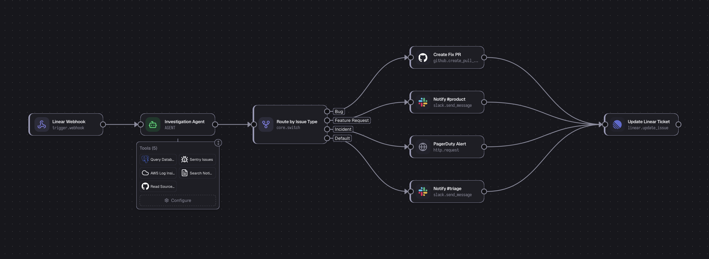

<p align="center">
  <picture>
    <source media="(prefers-color-scheme: dark)" srcset=".github/assets/logo-light.svg">
    
  </picture>
</p>

<h1 align="center">invect</h1>

<p align="center">
  Drop-in AI workflows for your Node.js app.
  <br />
  <a href="https://invect.dev/docs"><strong>Documentation</strong></a> · <a href="https://invect.dev/docs/quick-start"><strong>Quick Start</strong></a> · <a href="https://github.com/robase/invect"><strong>GitHub</strong></a>
</p>

<p align="center">
  <a href="https://opensource.org/licenses/MIT"></a>
</p>

<p align="center">
  <a href="https://invect.dev/demo">
    
  </a>
</p>

<p align="center">
  <a href="https://invect.dev/demo"><strong>Try the live demo →</strong></a>
</p>

---

Invect is an open-source workflow orchestration library you mount directly into your existing Express, NestJS, or Next.js app. Visual flow editor, AI agent nodes, 50+ built-in integrations, and batch processing — all as a library, not a platform.

## Quick Start

```bash
npx invect-cli init
```

Or install manually:

```bash
npm install @invect/core @invect/express @invect/ui
```

### Backend

```ts
import express from 'express';
import { createInvectRouter } from '@invect/express';

const app = express();

const invectRouter = await createInvectRouter({
  database: {
    type: 'sqlite',
    connectionString: 'file:./dev.db',
  },
  encryptionKey: process.env.INVECT_ENCRYPTION_KEY, // npx invect-cli secret
});

app.use('/invect', invectRouter);
app.listen(3000);
```

### Frontend

```tsx
import { Invect } from '@invect/ui';
import '@invect/ui/styles';

export default () => <Invect apiBaseUrl="http://localhost:3000/invect" />;
```

## Features

- **Visual Flow Editor** — Drag-and-drop workflow builder with real-time execution monitoring.
- **AI Agent Nodes** — Iterative tool-calling loops with OpenAI and Anthropic APIs.
- **100+ Built-in Actions** — Gmail, Slack, GitHub, Google Drive, Linear, Postgres, and more.
- **Batch Processing** — Cut AI costs 50% with native OpenAI and Anthropic batch APIs.
- **AI-Assisted Builder** — Describe what you need in plain language and the assistant wires up nodes for you.
- **Multi-Database** — SQLite, PostgreSQL, and MySQL. Works with Drizzle ORM, Prisma, or raw SQL migrations.
- **Framework Agnostic** — One core, thin adapters for Express, NestJS, and Next.js.

## Packages

| Package                                                      | Description                                                     |
| ------------------------------------------------------------ | --------------------------------------------------------------- |
| [`@invect/core`](pkg/core)                                   | Framework-agnostic engine — flows, execution, actions, database |
| [`@invect/express`](pkg/express)                             | Express router adapter                                          |
| [`@invect/nestjs`](pkg/nestjs)                               | NestJS module adapter                                           |
| [`@invect/nextjs`](pkg/nextjs)                               | Next.js App Router handler                                      |
| [`@invect/ui`](pkg/ui)                                       | React flow editor and dashboard                                 |
| [`@invect/cli`](pkg/cli)                                     | CLI for schema generation, migrations, and project setup        |
| [`@invect/user-auth`](pkg/plugins/auth)                      | Authentication plugin (Better Auth)                             |
| [`@invect/rbac`](pkg/plugins/rbac)                           | Role-based access control plugin                                |
| [`@invect/webhooks`](pkg/plugins/webhooks)                   | Webhook triggers with signature verification and rate limiting  |
| [`@invect/version-control`](pkg/plugins/version-control)     | Sync flows to GitHub/GitLab/Bitbucket as `.flow.ts` files       |
| [`@invect/cloudflare-agents`](pkg/plugins/cloudflare-agents) | Compile flows to Cloudflare Workers & Workflows                 |
| [`@invect/mcp`](pkg/plugins/mcp)                             | Model Context Protocol server for AI coding agents              |

## Examples

| Example                                                         | Stack                 | Purpose                                 |
| --------------------------------------------------------------- | --------------------- | --------------------------------------- |
| [`express-drizzle`](examples/express-drizzle)                   | Express + SQLite      | Primary backend dev server              |
| [`vite-react-frontend`](examples/vite-react-frontend)           | Vite + React          | Standalone frontend for the flow editor |
| [`nest-prisma`](examples/nest-prisma)                           | NestJS + Prisma       | NestJS adapter example                  |
| [`nextjs-app-router`](examples/nextjs-app-router)               | Next.js 15            | Self-contained Next.js example          |
| [`nextjs-drizzle-auth-rbac`](examples/nextjs-drizzle-auth-rbac) | Next.js + Auth + RBAC | Full-featured example with plugins      |

## Development

```bash
pnpm install
pnpm dev           # Interactive menu
pnpm dev:fullstack # Express backend + Vite frontend
pnpm test          # Unit + integration tests
pnpm test:pw       # Playwright tests
pnpm typecheck     # Type-check all packages
```

## License

[MIT](LICENSE)
